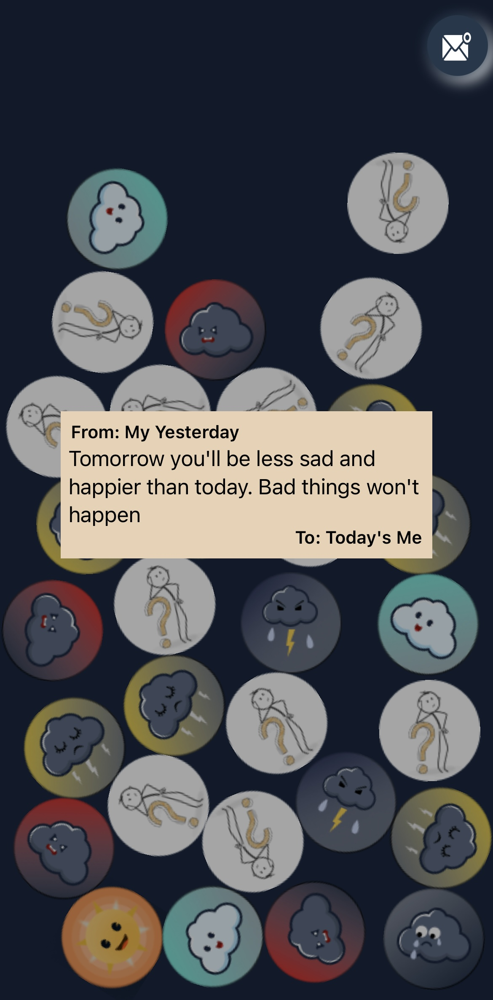
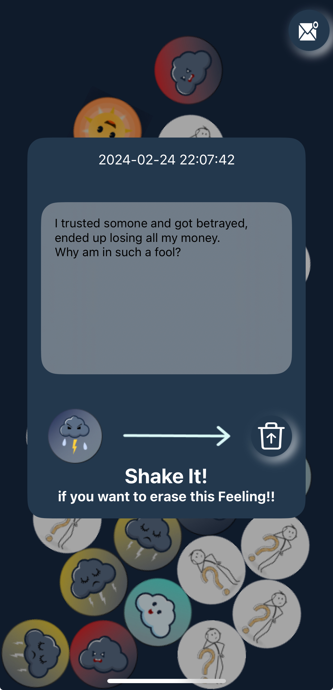
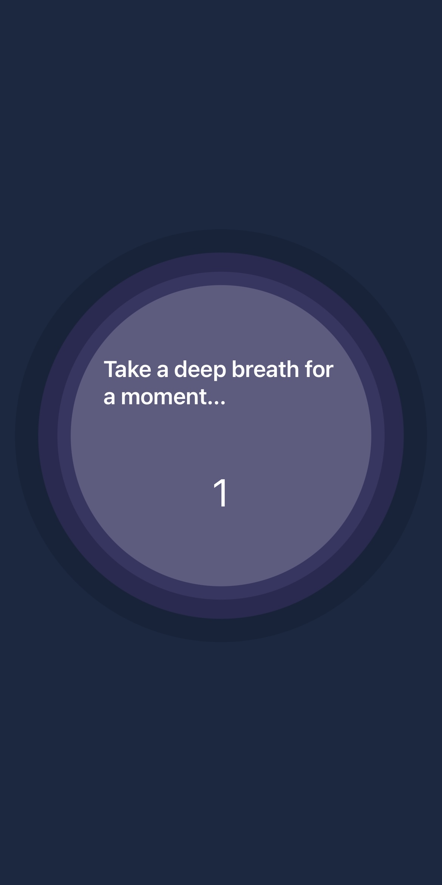
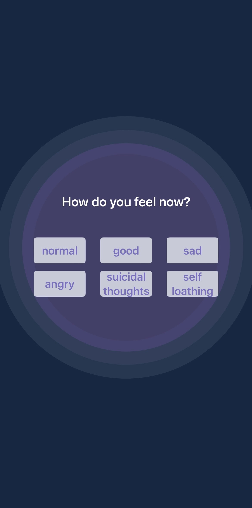
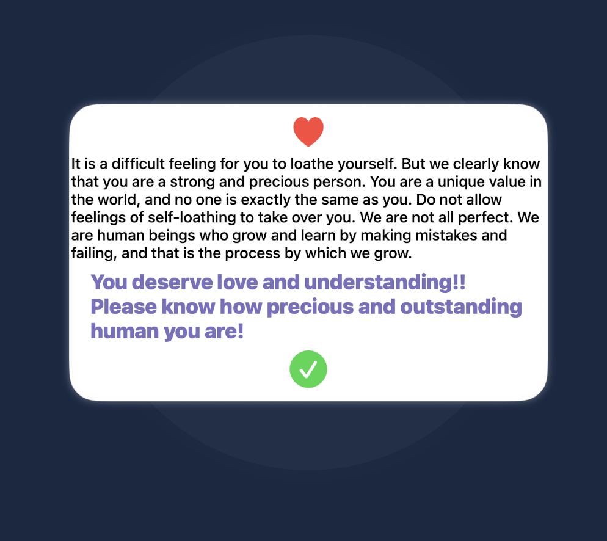

## 🔮MoodBeads

### ❔About
MoodBeads is an app designed to help users experiencing emotional distress, with a focus on depression and suicide prevention. It was created with the intention of saving at least one more life by enabling users to articulate their emotions, write diary entries to their future selves, and discard emotional clutter.

 

  

### 🛠 Features
- Sending Letters to Tomorrow's Self: Receive a letter from your previous day's self each day, fostering hope and encouragement for the future. Write letters to your future self, promoting reflection and anticipation for the days ahead. It is saved by AppStoarge.
- Interactive Emotion Beads: Utilizing SpriteKit and CoreMotion, 30 interactive moodBeads move in response to device tilt, providing users with a dynamic visualization of their emotional states and fostering tranquility through self-reflection
- Enhanced Self-Understanding: Contemplate for three seconds with meditative music before selecting an emotion, enhancing self-understanding by articulating the reasons behind your feelings.
- Emotion Storage and Display: Store emotions and reasons using SwiftData, with each bead symbolizing a different feeling. Selecting a bead displays the recorded reasons and feelings, allowing for reflection and growth.
- Supportive Messaging: Provide tailored messages offering support and guidance for individuals experiencing severe depression, aimed at fostering resilience and reinforcing self-worth.
- Emotion Discard: Vigorously shake the phone to discard emotions, symbolizing growth and the ability to move past difficult times.

### Background
Last September at dawn, I met someone at a bus stop who planned to commit suicide, overwhelmed by self-loathing and resentment. After dedicating two hours advising her on self-love and managing emotions, I was able to prevent her attempt and ensure her safety. This incident highlighted the urgent need to address the escalating issues of suicide and depression, not just in South Korea but globally. Inspired to make a difference, I developed an app with the hope of saving lives. The app offers intervention strategies for users with suicidal thoughts by highlighting the consequences of common suicide methods and promoting relieve stress through a psychological technique that involves snapping a rubber band on the wrist. If self-hatred is chosen, it reminds users of their worth. Each bead's color has significance, with yellow beads specifically designed to prevent suicide. Additionally, by enabling users to send letters to their future selves, the app fosters hope for tomorrow, encouraging users to continue living at least one more day. For individuals with depression, articulating their emotions in detail is crucial. My goal with this app is to save at least one more life through detailed emotional expression.
